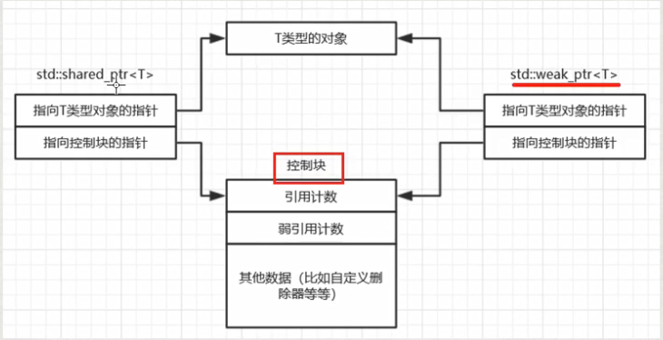

## weak_ptr概述:辅助shared_ptr进行工作的
>弱指针weak_ptr，强指针shared_ptr
1. weak_ptr也是一个类模板，也是一个智能指针。这个智能指针指向一个shared_ptr指向的对象，但是weak_ptr这种指针不影响对象的生命周期，换句话说，将weak_ptr绑定到shared_ptr上并不会改变shared_ptr的引用计数（更确切的说，weak_ptr的构造和析构不影响指针的引用计数）。当shared_ptr需要释放对象的时候照常释放，不管是否有weak_ptr指向该对象。
2. 弱指针的作用：可以理解成监视shared_ptr(强引用)的生命周期用的，是一种对shared_ptr的扩充。不是一种独立的指针，不能用来操作指向的资源，看起来像shared_ptr的助手。
3. weak_ptr的创建
   ```
   auto pi = make_shared<int>(100);
   weak_ptr<int> piw(pi);
   //piw弱共享pi,pi引用计数（强引用计数）不变，但是弱引用计数器会改变，强引用计数才能决定对象生命周期，而弱引用计数并不影响对象的生命期。
   ```

## weak_ptr类的常用操作
1. lock()
   >功能就是检查weak_ptr所指向的对象是否存在，如果存在，那么这个lock他就返回一个指向该对象的shared_ptr，如果不存在，则返回一个空的shared_ptr。
   ```
   auto pi2 = piw.lock(); //piw是一个weak_ptr, pi2是一个shared_ptr
   if(pi2 != nullptr)
   {
       *pi2 = 12;
   }
   ```
2. use_count()
   >获取与该弱指针共享对象的其他shared_ptr的数量，或者说获得当前所观测资源的强引用计数。

3. expired()
   >是否过期的意思。弱指针的use_count()为0（表示该弱指针所指向的对象已经不存在了），则返回true，否则返回false。

4. reset()
   > 将该弱相用的指针设置为空，不影响指向该对象的强引用数量，但指向该对象的弱引用数量会减少1；

## 尺寸问题
1. weak_ptr和shared_ptr的尺寸一样大，是裸指针的2倍。包含两个裸指针，第一个指针指向的是这个智能指针所指向的对象，第二个指针指向一个很大的数据结构（控制块）
   * 控制块有强引用计数
   * 控制块有弱引用计数
   * 其他数据，比如自定义删除器的指针等
