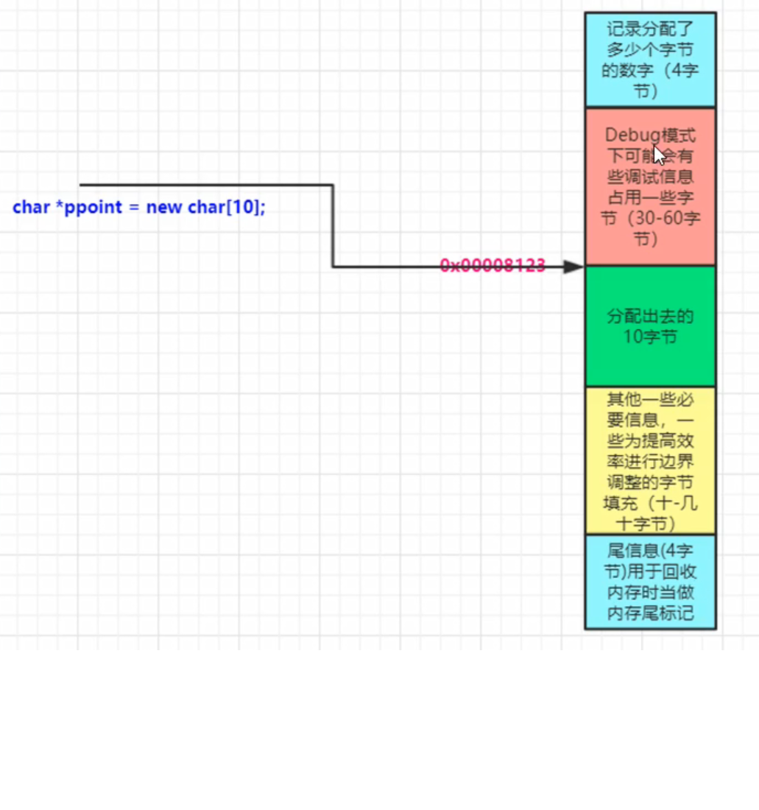
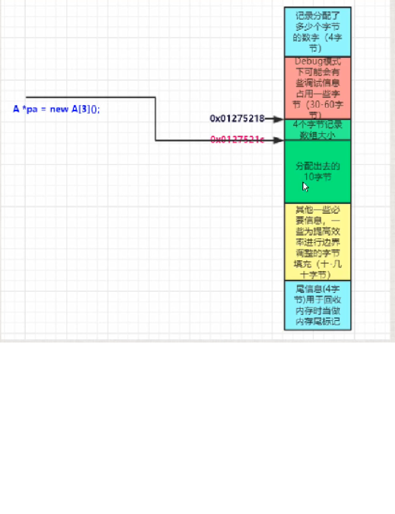

## new内存分配细节控秘
1. 一块内存的回收，影响范围很广，远远不是指定的几个字节，new和delete看上去没有那么简单，其内存是很复杂的。编译器会做很多的事情，比如记录分配出去的内存等。
2. 分配内存时，为了记录内存相关的一些信息，会造成浪费，尤其是在申请小块的内存的时候


## 重载类中的operator new() 和 operator delete() 操作
```
class A{
    public:
        static void operator new(size_t size);
        static void operator delete(void *phead);
}

void *A::operator new(size_t size)
{
    //.. 这儿可以做一些相应的统计
    A *ppoint = (A*)malloc(size);
    return ppoint;
}

void *A::operator delete(void *phead)
{
    free(phead);
}
```
>在前面加::的时候，可以不调用自己定义的operator new和operator delete  
```
A a =::new A();
::delete a;
```
>如果分配的是数组或者释放的是数组，要重载的是带[]的操作符
```
class A{
    public:
        static void operator new(size_t size);
        static void operator delete(void *phead);
}

void *A::operator new[](size_t size)
{
    //.. 这儿可以做一些相应的统计
    A *ppoint = (A*)malloc(size);
    return ppoint;
}

void *A::operator delete[](void *phead)
{
    free(phead);
}
```
>构造和析构被调用了数组大小的次数，但operator new[] 和 operator delete[] 只会调用一次  

