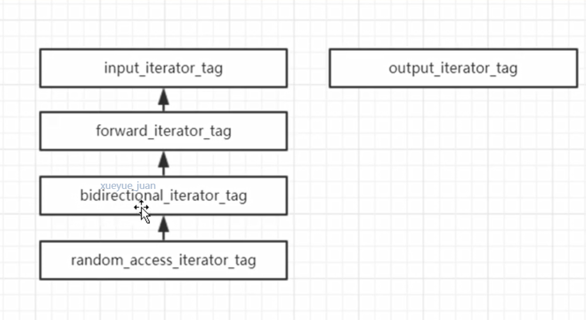
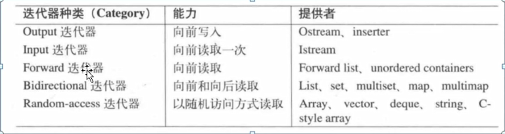
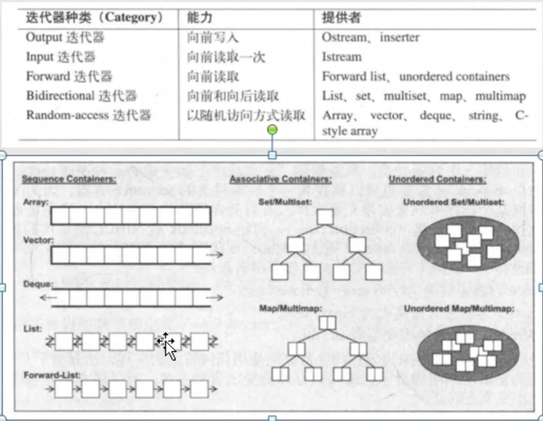

## 迭代器的概念
1. 迭代器是一个“可遍历STL容器全部或者部分元素”的对象，行为类似于指针的对象。

## 迭代器的种类
1. 分类的依据：依据是迭代器的移动特性以及迭代器上能够做的操作。
   >迭代器，行为如指针，到处跳，表示一个位置，我们一般分类是依据他的跳跃能力，每一个分类是一个对应的struct定义。
   1. 输出型迭代器（output iterator）
      >一个一个向前，可以通过迭代器改写容器的元素。
   2. 输入型迭代器
      >一个一个向前，读取容器中元素的值。
   3. 前向迭代器
      >继承自输入型迭代器，并且读取时提供额外的保证。
   4. 双向迭代器
      >在前向迭代器的基础上，增加反向迭代。
   5. 随机迭代器
      >在双向迭代器的基础上，增加偏移量，可访问迭代器的能力。

1. 迭代器的能力
   

3. 迭代器与容器

