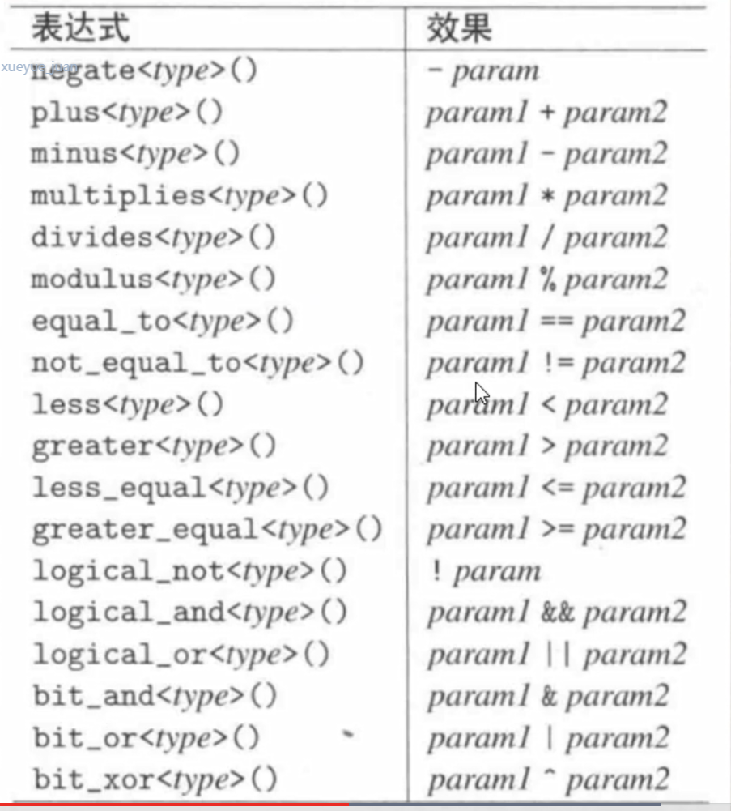

## 函数对象/仿函数 回顾
1. 在STL中，一般都是和算法配合使用，从而实现一睦特殊的功能，这些函数对象主要服务于算法。
2. 函数对象、仿函数包括：函数，可调用对象，lambda表达式

## 标准库中也提供了很多现成可使用的函数对象
``` #include <function> ```



1. 算术运算类
2. 关系运算类
3. 逻辑运算类
4. 位运算类

```
sort(myvector.begin(), myvector.end(),greater<int>()); 
//greater<int> 产生临时对象，称呼为系统定义的函数对象
```