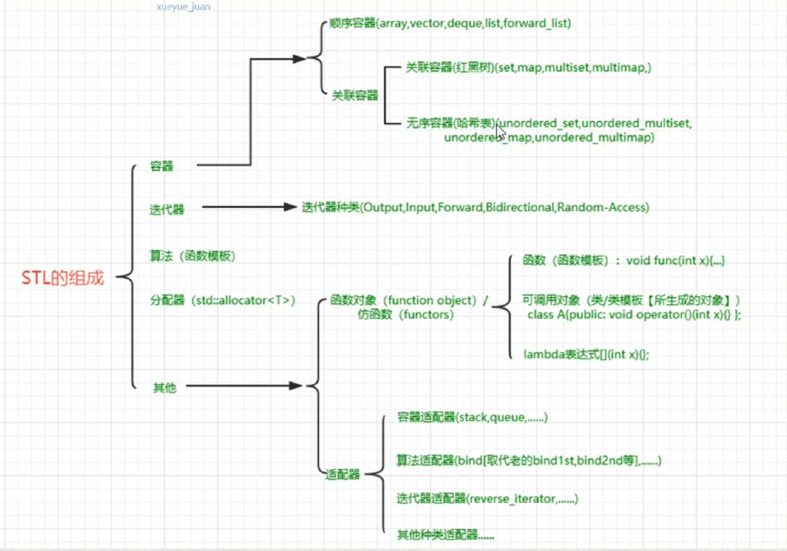

## 适配器基本概念
1. 转接头的概念，把一个既有的东西，进行适当的改造，就得到一个适配器。

## 容器适配器
1. stack:阉割版的deque
2. queue:阉割版的deque

## 算法适配器（函数适配器）
1. 最典型的就是绑定器binder
2. 老版本bind1st,bind2st; C++11中,名字被修改为bind
   ```
   count_if(myvector.begin(), myvector.end(), std::bind(std::less<int>, 40, placeholders::_1));
   //统计myvector中大于40的元素的数量
   ```

## 迭代器适配器
1. 返向迭代器reverse_iterator

## 总结


