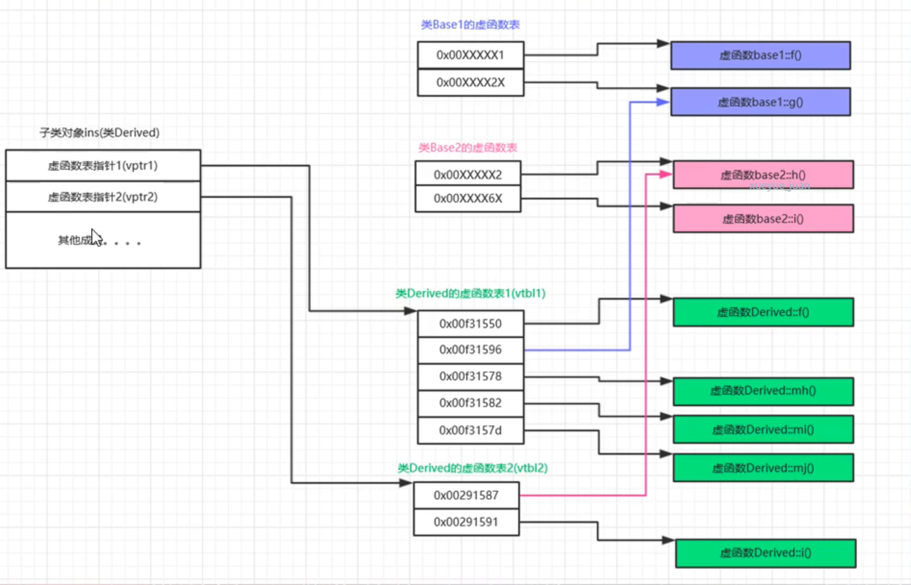

## 多重继承虚函数表分析
1. 一个对象，如果它的类有多少个基类，则有多个虚函数指针（注意是虚函数指针，而不是虚函数表）。
2. 在多继承中，对应各个基类的vptr按继承顺序依次放置在类的内存空间中，且子类与第一个基类共用一个vptr(第二个基类有自己的vptr)
3. 子类Derived继承多少个基类，则有多少个虚函数表。
4. 子类和第一个基类共用一个vptr(因为vptr指向第一个虚函数表，所以也可以说子类和第一个基类共用一个虚函数表vtbl)。
5. 子类中的虚函数，覆盖父类中同名的虚函数
6. 多重继承虚函数表图
