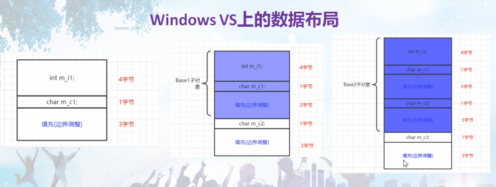
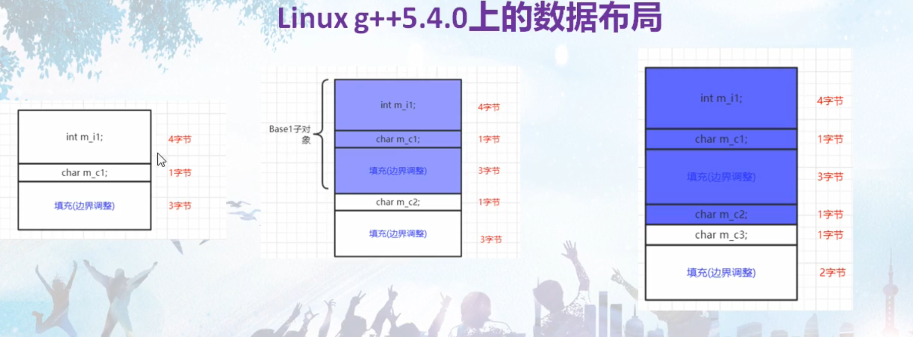

## 单一继承下的数据成员布局
1. 一个子类对象所包含的内容，是它自己的成员加上它父类的成员的总和。
2. 从偏移值来看父类成员先按定义顺序出现，子类成员再按定义顺序出现。
3. 引入继承关系后，可能会带来内存空间的增加，主要是内存对齐导致的，不同的编译环境可能稍有差别。
   1. windows上的数据布局
   
   2. linux上的数据布局
   
4. 在做内存拷贝的时候，由于内存布局的不一样，对于继承关系的拷贝要特别注意。