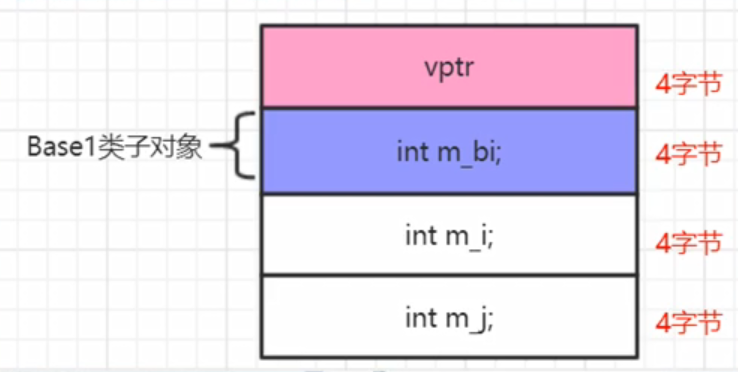
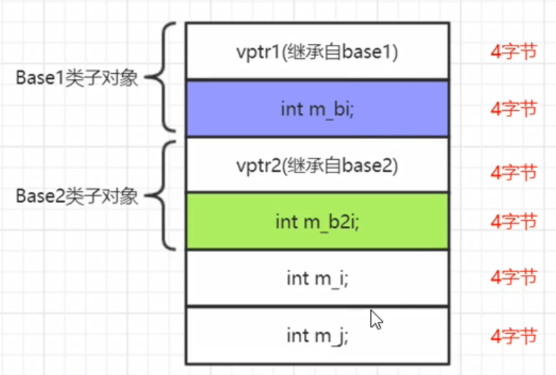

## 单一继承数据成员布局this指针偏移知识补充
1. this指针调整



## 多重继承且父类都带虚函数的数据成员布局
1. 通过this指针打印，我们看到访问Base1成员不用跳，访问Base2成员this指针要偏移（跳过）8字节
2. 我们看到base1的第一个成员变量和base2的第一个成员变量偏移量都为4
3. this指针加上偏移值就能够访问对应的成员变量，比如 m_b2 = this指针 + 偏移值
4. 结论：我们要访问一个类对象中的成员，成员的定位是通过：this指针（编译器会自动调整）以及该成员的偏移值，这两个因素来定义；这种this指针偏移的调整，都需要编译器介入来处理完成。

5. 例子1
   >将子类对象赋值给父类对象时，地址是会经过调整的。会调整到子对象中对应基类子对象的this地址。
   ```
   Base2 *pbase2 = &myobj; //this指针调整导致pbase2实际是向前走8个字节的内存位置
   //站在编译器的视角，把上边这行语句进行调整
   Base2 *pbse2 = (Base2 *)(((char*)&myobj)+sizeof(Base1));
   ```
6. 例子2
   >new一个子类对象给父类，再将父类转换成子类
   ```
   Base2 *pbase2 = new MYACLS();//父类指针new子类对象，这里new出来的是24字节
   MYACLS *psubobj=(MYACLS *)pbase2; //this进行了相应的调整，比上面的地址少了8字节（偏移值）
   delete pbase2; //报异常，这个不是分配的首地址
   delete psubobj; //正常
   ```



## 掌握内存布局的分析手法
1. 调试  ------ 查看内存布局  