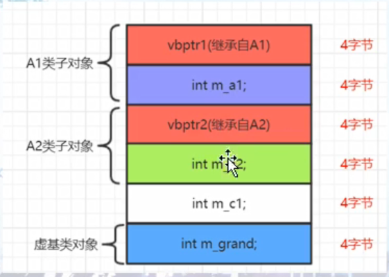

## 虚基类（虚继承、虚派生）问题的提出
1. 传统多重继承：会造成多次拷贝，导致空间问题，效率问题，二义性问题
2. 通过引入虚继承，引入虚基类，可以解决传统多重继承的问题
3. 一般至少3层继承结构，才会体现出虚继承的作用，主要在孙子类对象里面反映出是否复制了多份爷爷类的子对象

## 虚基类初探
1. 虚基类表vbtable(virtual base table)
2. 虚基类表指针vbptr(virtual base table pointer)
>不同的编译器对虚基类底层的实现不一样，以vs2017为参考
   ```
   class Grand
   {

   };
   class A1:public virtual Grand
   {

   };
   class A2:public virtual Grand
   {

   };
   class C:public A1, public A2
   {

   };
   ```
   1. 空类sizeof(Grand)为1
   2. 虚继承后sizeof(A1)为4，被插入了虚基类表指针
   3. 虚继承后sizeof(C1)为8，被插入了两个虚基类表指针
   4. 所有虚基类的爷爷成员都被放到最后


