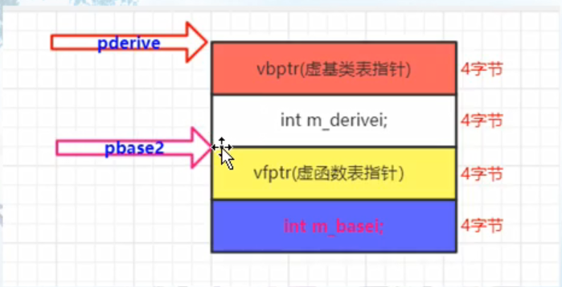

## 多继承第二基类对虚函数支持的影响（this指针调整作用）
1. 子类继承了几个父类，子类就有几个虚函数表
2. this指针调整的目的，就是让对象指针正确的指向对象首地址，从而正确的调用对象的成员函数或者说正确确定数据成员的存储位置。以下场景会涉及指针调整
   1. 通过指向第二个基类的指针调用继承类的虚函数
      ```
      Base2 *pb2= new Derive();
      delete pb2; //调用继承类的虚析构函数
      ```
   2. 一个指向派生类的指针，调用第二个基类中的虚函数
      ```
      Derive *pd2 = new Derive();
      pd2->hBase2();
      ```
   3. 允许虚函数的返回值类型有所变化
      ```
      Base2 *pb1 =new Derive();  //pb1指向的是Base2子对象的首地址
      Base2 *pb2 = pb1->clone(); //Derive::clone(); 
      //执行clone时，pb1首先会调整回指向Derive对象的首地址，这样调用的是Derive版本的clone。
      //执行完clone时，又将this指针调整回指向Base2子对象的首地址
      ```
## 虚继承下的虚函数
> 有了虚基类又有虚函数时，整个内存的布局发生了很大的变化。大概顺序为：
   1. 虚基类表指针
   2. 派生类成员变量
   3. 虚函数表指针
   4. 基类成员变量
