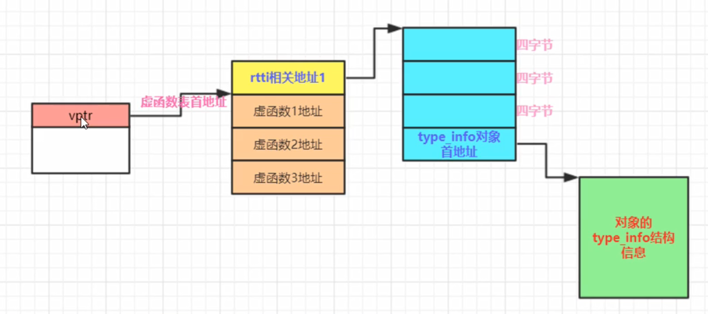

   ## RTTI（运行时类型识别）简单回顾 
   ```
   Base *pb = new Derive();
   pb->g();

   Derive myderive;
   Base &yb = myderive;
   yb.g();
   ```
   >像上面这些代码，在编译时pb和yb的类型是不确定的，只有在运行的时候才能够正确的识别出来，运用的就是RTTI（运行时识别技术）
   1. C++运行时类型识别RTTI,要求父类中必须至少有一个虚函数，如果父类中没有虚函数，那么得到RTTI就不准确。RTTI就可以在执行期间查询一个多态指针，或者多态引用的信息。
   2. RTTI的能力靠typeid和dynamic_cast运算符来实现。

## RTTI实现原理
1. typeid返回的是一个常量对象的引用，这个常量对象的类型一般是type_info（类）;
   ```
   const std::type_info &tp = typeid(*pb);
   Base *pb2 = new Derive();
   const std::type_info &tp2 = typeid(*pb2);
   if(tp == tp2)
   {
       cout <<"很好，类型相同" << endl;
   }
   ```
2. RTTI的测试能力跟基类中是否存在虚函数有关系，如果基类中没有虚函数，也就不存在基类的虚函数表，RTTI就无法得到正确的结果。
   

## vptr,vbtr,rtti的type_info信息构造时机
1. vbtr和rtti在编译的时候就已经存在了，写到了可执行文件中。rtti