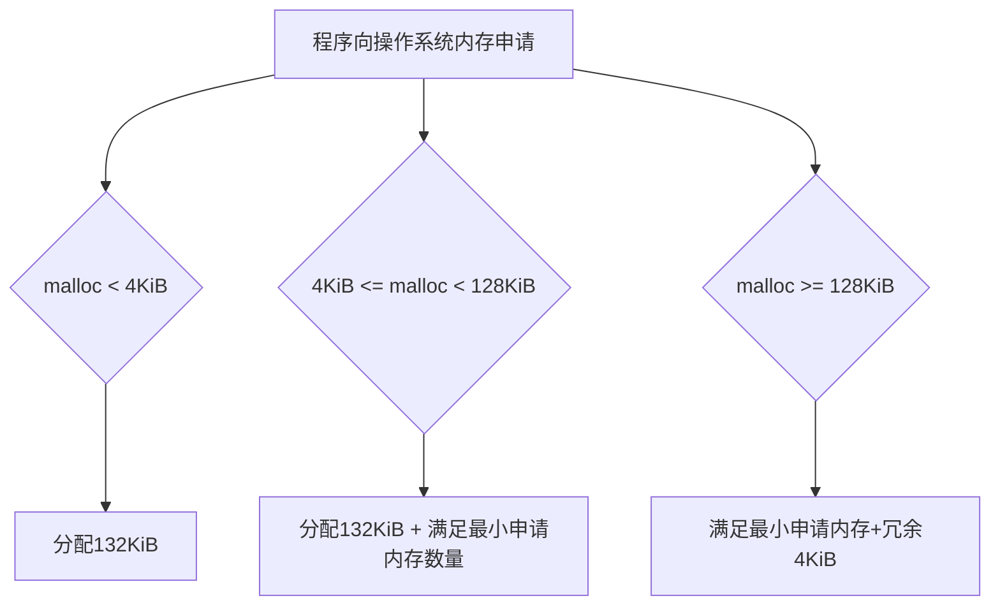
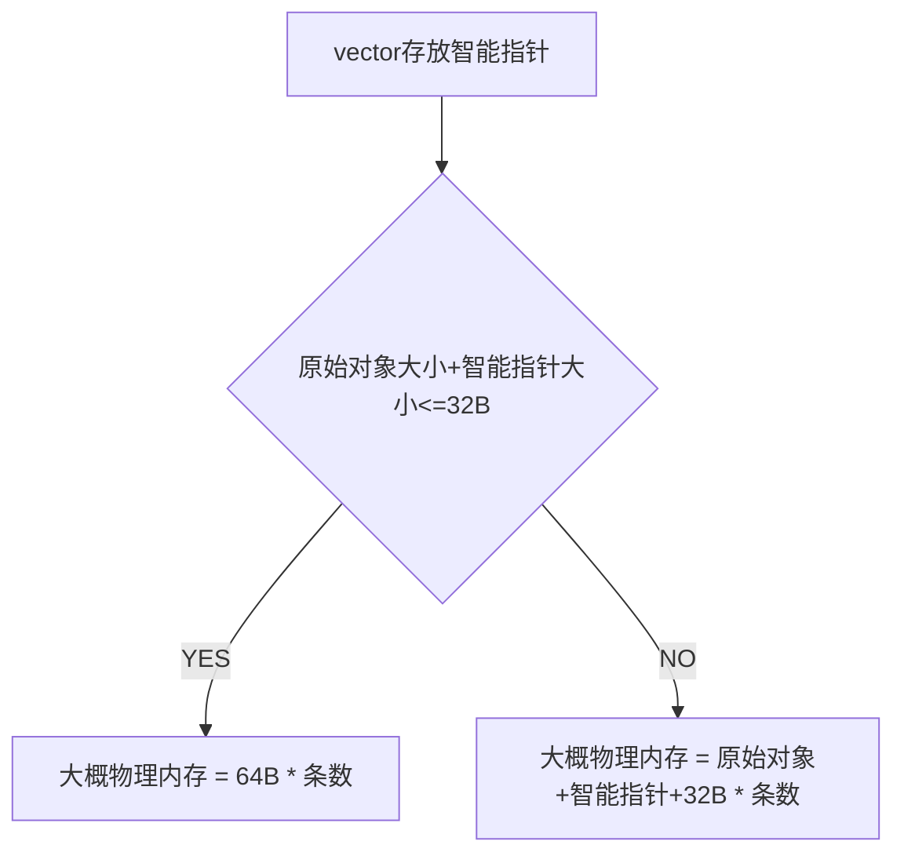

<center><h3>文档修改记录</h3></center>

| 日期       | 版本号 | 作者   | 操作                         | 说明 |
| ---------- | ------ | ------ | ---------------------------- | ---- |
| 2021-01-08 | v1.0.0 | 程开雄 | 创建                         |      |
| 2021-01-08 | v1.0.1 | 程开雄 | 增加多次内存分配数据统计分析 |      |

## 1. 操作系统内存分配机制

> 操作系统分配内存的时候，是一块一块分配的，在具体内存分配的过程中，如果未使用内存池技术或使用得不好，则会导致大量的内存碎片。现使用 malloc 对内存进行分配，以查看操作系统实际每次对内存分配的情况。

### 测试环境

```shell
[root@localhost test]# cat /etc/os-release 
NAME="CentOS Linux"
VERSION="7 (Core)"
ID="centos"
ID_LIKE="rhel fedora"
VERSION_ID="7"
PRETTY_NAME="CentOS Linux 7 (Core)"
ANSI_COLOR="0;31"
CPE_NAME="cpe:/o:centos:centos:7"
HOME_URL="https://www.centos.org/"
BUG_REPORT_URL="https://bugs.centos.org/"

CENTOS_MANTISBT_PROJECT="CentOS-7"
CENTOS_MANTISBT_PROJECT_VERSION="7"
REDHAT_SUPPORT_PRODUCT="centos"
REDHAT_SUPPORT_PRODUCT_VERSION="7"
```
## 1.1 单次内存分配

### 1.1.1 测试方法

> 每次手动申请内存，观察对应程序分配内存情况，再对申请内存进行释放，再观察分配内存的情况。

1. 测试代码

```cpp
[root@localhost test]# cat memory.cpp 
#include <stdio.h>      /* printf, scanf, NULL */
#include <stdlib.h>     /* malloc, free, rand */
#include <unistd.h>

int main ()
{
    int i,n;
    char * buffer;

    printf ("How long do you want the string? ");
    scanf ("%d", &i);
    
    buffer = (char*) malloc (i+1);
    if (buffer==NULL) exit (1);
    for (n=0; n<i; n++)
        buffer[n]=rand()%26+'a';
    buffer[i]='\0';
    
    printf("malloc size: %d\n", (i+1));
    sleep(30);
    free (buffer);
    printf ("memory release: %d\n",(i+1));
    
    sleep(30);
    return 0;
}
```

2. 如下命令观察内存

```shell
top -Hp $pid
```

### 1.1.2 测试数据 

| malloc 分配字符数  | 实际SHR KiB          | 实际RES KiB            | 实际VIRT KiB            | 实际分配大小 KiB  |
| ------------------ | -------------------- | ---------------------- | ----------------------- | ----------------- |
| 程序初始大小       | 276                  | 352 or 348             | 4220                    | -                 |
| 1 B                | 276                  | 352 or 348             | 4352                    | 132               |
| 100 B              | 276                  | 352 or 348             | 4352                    | 132               |
| 1024 B (1 KiB)     | 276                  | 352 or 348             | 4352                    | 132               |
| 2048 B (2 KiB)     | 276                  | 352                    | 4352                    | 132               |
| 4096 B (4 KiB)     | 276                  | 352 or 348             | 4356                    | **132  + 4**      |
| 8192 B (8 KiB)     | 276                  | 352 or 348             | 4360                    | 132  + 8          |
| 12288 B (12 KiB)   | 276                  | 352 or 348             | 4364                    | 132  + 12         |
| 65536 B (64 KiB)   | 276                  | 352 or 348             | 4416                    | 132 + 64          |
| 131072 B (128 KiB) | 424                  | 612<----free---->532   | 4352                    | **132 = 128 + 4** |
| 262144 B (256 KiB) | 424<----free---->436 | 608<----free---->528   | 4480<----free---->4220  | 256 +4            |
| 263168 B (257 KiB) | 424                  | 612                    | 4480                    | **256+4**         |
| 524288 B (512KiB)  | 436                  | 876                    | 4736                    | 512 + 4           |
| 1048576 B (1 MiB)  | 424                  | 1400                   | 5248                    | 1024 +4           |
| 67108864 B(64 MiB) | 424                  | 65820<----free---->532 | 69760<----free---->4220 | 64M + 4K          |

### 1.1.3 测试结果

**从测试数据分析**：操作系统为程序分配内存时，最小内存分配单位为 `4KiB` 其规律如下：



**NOTE**:对于常驻内存和共享内存是怎么变换的，这个换页机制，还有待研究。

## 1.2 多次内存分配

### 1.2.1 测试方法

> 每次手动申请内存，分配完成后，观察对应程序分配内存情况，每次申请 100W 次。

```
[root@localhost test]# cat memory.cpp 
#include <stdio.h>      /* printf, scanf, NULL */
#include <stdlib.h>     /* malloc, free, rand */
#include <unistd.h>

int main ()
{
    int i,n;
    char * buffer;

    while(true)
    {
        printf ("How long do you want the string? ");
        scanf ("%d", &i);
        for(int j=0; j<1000000; ++j)
        {
            buffer = (char*) malloc (i+1);
            if (buffer==NULL) exit (1);
            for (n=0; n<i; n++)
                buffer[n]=rand()%26+'a';
            buffer[i]='\0';
        }
   
        printf("100W malloc size: %d\n", (i+1));
        sleep(30);
   
    }

    return 0;
}
```

### 1.2.2 测试数据

| malloc 分配字符数(100W次) | 实际申请总大小 MiB | 实际SHR KiB | 实际RES KiB | 实际VIRT KiB | 实际 VIRT MiB |
| ------------------------- | ------------------ | ----------- | ----------- | ------------ | ------------- |
| 程序初始大小              | 程序初始大小       | 276         | 352 or 348  | 4220         |               |
| 10B                       | 9.537              | 432         | 31764       | 35504        | 30.55078125   |
| 20B                       | 19.074             | 432         | 31760       | 35504        | 30.55078125   |
| 30B                       | 28.611             | 432         | 47340       | 51212        | 45.890625     |
| 60B                       | 57.222             | 432         | 78488       | 82364        | 76.3125       |
| 100B                      | 95.37              | 436         | 109908      | 113648       | 106.8632813   |
| 120B                      | 114.444            | 432         | 125444      | 129224       | 122.0742188   |
| 180B                      | 171.666            | 432         | 188016      | 191792       | 183.1757813   |
| 200B                      | 190.74             | 432         | 203592      | 207368       | 198.3867188   |
| 300B                      | 286.11             | 432         | 312848      | 316796       | 305.25        |
| 250B                      | 238.425            | 432         | 266120      | 269936       | 259.4882813   |
| 500B                      | 476.85             | 440         | 500536      | 504236       | 488.296875    |
| 750B                      | 715.275            | 440         | 750540      | 754244       | 732.4453125   |


| malloc 分配字符数(100W次) | 实际申请总大小 MiB | 实际SHR KiB | 实际RES KiB | 实际VIRT KiB | 实际 VIRT MiB |
| ------------------------- | ------------------ | ----------- | ----------- | ------------ | ------------- |
| 程序初始大小              | 程序初始大小       | 276         | 352 or 348  | 4220         |               |
| 10B                       | 9.537              | 432         | 31764       | 35504        | 30.55078125   |
| 10B + 10B                 | 19.074             | 444         | 62916       | 66788        | 61.1015625    |
| 10B + 10B + 10B           | 28.611             | 444         | 94068       | 98072        | 91.65234375   |
| 60B                       | 57.222             | 432         | 78488       | 82364        | 76.3125       |
| 100B                      | 95.37              | 436         | 109908      | 113648       | 106.8632813   |
| 60B + 60B                 | 114.444            | 444         | 156592      | 160508       | 152.625       |
| 60B + 60B + 60B           | 171.666            | 444         | 234728      | 238652       | 228.9375      |
| 100B + 100B               | 190.74             | 444         | 219168      | 223076       | 213.7265625   |
| 100B + 100B + 100B        | 286.11             | 444         | 328420      | 332372       | 320.4609375   |
| 250B                      | 238.425            | 432         | 266120      | 269936       | 259.4882813   |
| 250B+250B                 | 476.85             | 444         | 531680      | 535520       | 518.8476563   |
| 250B + 250B + 250B        | 715.275            | 444         | 797264      | 801104       | 778.2070313   |


### 1.2.3 测试结果

**从测试数据分析**：

程序启动一次，申请一批，一批申请分配 100W 次内存，分配的总内存会比申请的总内存由最初的 3 倍左右到逐渐与申请的内存大小相近，随着申请内存的总量接近 750M 时，差距在 10MiB~30MiB 左右，相对来说还较为集中，碎片化程度还不是太大（应该有更先进的工具来分析，这个还需要进一步研究）。

程序启动一次，分多批申请，一批申请分配 100W 次内存，相对前一种只申请一批的情况，申请同样大小的内存，分多批次分配的内存较大，可以看出内存碎片程度较大一些，由申请的小内存最初的 3 倍左右，到逐渐与申请的内存大小相匹配，随着申请内存的总量接近 750M 时，差距在30MiB ~ 60MiB 左右。而在真实的生产中，程序会一次启动，可能会跑很久，碎片程度要比这个严重得多。

## 1.3 C++ 智能指针存入 vector 内存分配

### 1.3.1 测试代码

```c++
#include <unistd.h>
#include <iostream>
#include <memory>
#include <vector>
using namespace std;

struct Demo
{
    long a;
    Demo(int ta):a(ta){}
};
typedef std::shared_ptr<Demo> DemoPtr;

int main()
{

   std::cout<<"demo size:"<<sizeof(Demo)<<endl;
   std::cout<<"demoptr size:"<<sizeof(DemoPtr)<<endl;
   std::vector<DemoPtr> lst;
   sleep(30);
   std::cout<<"read create obj"<<endl;
   long size = 0;
   for(int i=0;i <1000000; i++)
   {
       DemoPtr d=std::make_shared<Demo>(1);
       lst.push_back(d);
       size+=sizeof(Demo);
   }
   std::cout<<"total size:" << size << std::endl;
   sleep(30);

   return 0;
}
```

```shell
编译代码:
g++ -std=c++11 test_vector_ptr_min.cpp

使用boost::shared_ptr时例子
g++ -lboost_system -std=c++11 test_vector_ptr_min.cpp

使用 jemalloc 时例子
g++ -ljemalloc -lboost_system -std=c++11 test_vec_ptr_str_boost_gt4.cpp -o jemalloc.gt4.out
```

### 1.3.2 测试用例

| Demo 原始对象大小                               | DemoPtr 指针大小 | vector存100W个DemoPtr  | 程序物理内存大小 |
| ----------------------------------------------- | ---------------- | ---------------------- | ---------------- |
| 8                                               | 16               | 8,000,000+16,000,000   | 64,304 * 1024    |
| 16                                              | 16               | 16,000,000+16,000,000  | 63,432 * 1024    |
| 32                                              | 16               | 32,000,000+16,000,000  | 79,376 * 1024    |
| 48                                              | 16               | 48,000,000+16,000,000  | 94,928 * 1024    |
| 64                                              | 16               | 64,000,000+16,000,000  | 110,328 * 1024   |
| 128                                             | 16               | 128,000,000+16,000,000 | 173,020 * 1024   |
| 136(其中一个字符串是一个字段) std::shared_ptr   | 16               | 136,000,000+16,000,000 | 188,624 * 1024   |
| 136(其中一个字符串是一个字段) boost::shared_ptr | 16               | 136,000,000+16,000,000 | 188,776 * 1024   |
| 136(其中一个字符串是一个字段) jemalloc          | 16               | 136,000,000+16,000,000 | 212,396 * 1024   |

### 1.3.3 测试结论

**根据以上测试数据分析：**

在使用`C++11 std::shared_ptr` 和  `boost::shared_ptr` 做内存分配的情况下，其内存分配机制大致如下。但是合适了 `jemalloc` 后在这种单一的内存分配场景下，相对来说占用较多的一些内存。在实际生产中，使用 `jemalloc` 会对整体的内存分配有一个全局的提升。



## 1.4 C++中智能指针使用

**根据以上的一些测试和使用总结**：

在使用智能指针包装数据，在将包装后的智能指针放入 `vector` 时，如果数据比较小，在数据条数比较多的时候会造成大量的内存浪费，基本在 `30% ~ 50%` 左右。使用结果体，则不会造成空间的浪费，要注意的是对结构体的拷贝操作。