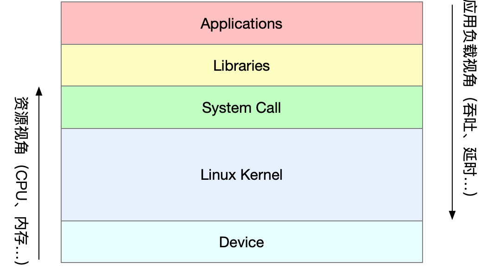
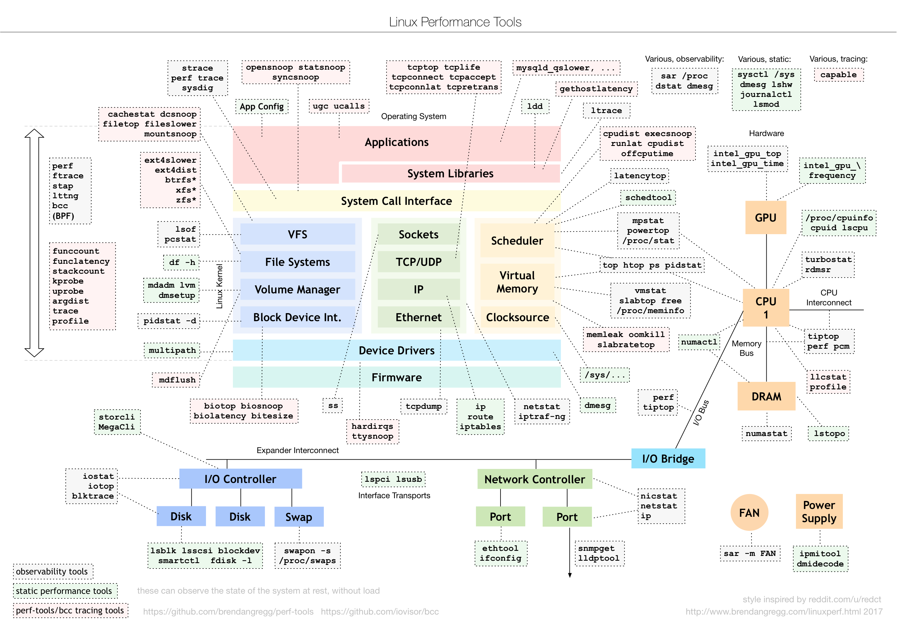

# 一、性能指标是什么？
1. 从不同的角度出发看到的指标不一样
   1. 从应用负载的视角：吞吐、延时
   2. 从系统资源的视角：资源使用率、饱和度等
   
2. 性能问题本质：系统资源已经达到瓶颈，但请求的处理却还不够快，无法支撑更多的请求。
3. 找出应用或系统的瓶颈，并设法去避免或者缓解它们，一些步骤如下：
   1. 选择指标评估应用程序和系统的性能;
   2. 为应用程序和系统设置性能目标;
   3. 进行性能基准测试;
   4. 性能分析定位瓶颈;
   5. 优化系统和应用程序;
   6. 性能监控和告警。

# 二、学习的重点是什么？
1. 建立整体系统性能的全局观是最核心的话题。
2. 合理使用性能工具，但不要把性能工具当成学习的全部

3. linux性能分析知识图谱
  

# 三、怎么学更高效？
1. 虽然系统的原理很重要，但在刚开始一定不要试图抓住所有的实现细节；

2. 边学边实践，通过大量的安全演习掌握Linux性能的分析和优化。

3. 勤思考，多反思，善总结，多问为什么。

4. 参考 Linux 优化大师的网址：http://www.brendangregg.com/linuxperf.html

   