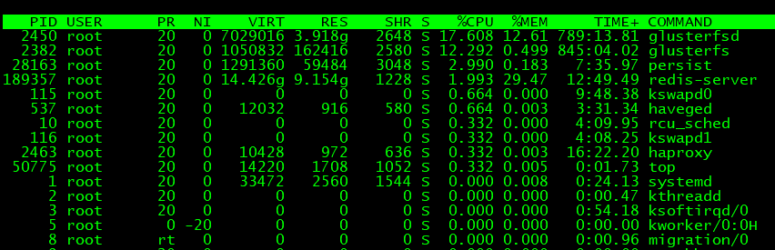

## 通过top查看系统性能相关信息
参考：[30 个实例详解 TOP 命令 ](https://mp.weixin.qq.com/s?__biz=MzAxODI5ODMwOA==&mid=2666541472&idx=1&sn=e55096ec7447c54aad1b534322f542b7&chksm=80dcf50bb7ab7c1d5b54f43ffde94d2d30487e6c95726568496f17e16422afad1d2c1383e6c2&mpshare=1&scene=1&srcid=1114zGcMlDNob2tc8aqIU178&pass_ticket=BFk1ncyev8KFx3EsclgjEGAtxg4D4%2BaorpsZZr5OGH8v%2B7Wboy5cSHFTcQdPe5TA#rd)
### top横排信息解释
```
top - 14:51:44 up 126 days, 22:17,  5 users,  load average: 6.00, 6.18, 6.18
```
> **系统运行时间和平均负载**：14:51:44; 系统运行了：126 days, 22:17；当前5个用户在线；每5、10、15分钟的负载为6.00，6.18，6.18，与`uptime`看到的结果一致。用`l`切换显示或隐藏。

```
Tasks: 256 total,   1 running, 255 sleeping,   0 stopped,   0 zombie
```
> **任务**：系统有256个进程，正在运行的有1个进程；255个进程在等待中；0个终止；0个僵尸进程；可以用`t`切换显示或隐藏。

```
%Cpu(s):  1.0 us,  0.4 sy,  0.0 ni, 96.6 id,  1.8 wa,  0.0 hi,  0.2 si,  0.0 st
```
> **CPU状态**：  
`us, user`： 运行(未调整优先级的) 用户进程的CPU时间；  
`sy，system`: 运行内核进程的CPU时间； 
`ni，niced`：运行已调整优先级的用户进程的CPU时间；  
`id,idle`:CPU空闲时间；   
`wa，IO wait`: 用于等待IO完成的CPU时间；  
`hi`：处理硬件中断的CPU时间；  
`si`: 处理软件中断的CPU时间；  
`st`：这个虚拟机被hypervisor偷去的CPU时间（译注：如果当前处于一个hypervisor下的vm，实际上hypervisor也是要消耗一部分CPU处理时间的）。  
时间以用`t`命令切换显示

```
KiB Mem:  32570728 total, 31851592 used,   719136 free,        0 buffers
KiB Swap: 20971516 total, 16057800 used,  4913716 free.  3542516 cached Mem
```
> **内存使用**：与`free`效果相同
KiB Mem:是物理内存使用，对应全部可用内存、已使用内存、空闲内存、缓冲内存；  
KiB Swap：是虚拟内存使用，全部、已使用、空闲和缓冲交换空间；
内存显示可以用`m`命令切换。


> **字段/列**  
* PID:进程ID,进程的唯一标识。  
* USER:进程所有者的实际用户名。  
* PR:进程调度优先级。这个字段的一些值是’rt’。这意味这这些进程运行在实时态。  
* NI:进程的nice值（优先级）。越小的值意味着越高的优先级。  
* VIRT:进程使用的虚拟内存。  
* RES:驻留内存大小,驻留内存是任务使用的非交换物理内存大小。  
* SHR:进程使用的共享内存。  
* S：是进程的状态，它有以下不同的值： 
   * D-不可中断  
   * R-运行状态  
   * S-睡眠态
   * T-被跟踪或已停止
   * Z-僵尸态
* %CPU:自从上一次更新时到现在任务所使用的CPU时间百分比.
* %MEM:进程使用的可用物理内存百分比(指可用的RES)
* TIME+:任务启动后到现在所使用的全部CPU时间，精确到百分之一秒。
* COMMAND:运行进程所使用的命令。
* 还有许多在默认情况下不会显示的输出，它们可以显示进程的页错误、有效组和组ID和其他更多的信息。

> top是一个交互式的命令，按h进行帮助，其他的可以根据情况进行查文档，勤加练习 。 

### 在top下一些命令的使用
**M**:按照内存一列进行排序，R可以进行逆序。  
**P**:按照CPU一列进行排序，R可以进行逆序。  
**E**:切换内存概要的显示单位。  
**e**:切换任务列表上，内存的显示单位。  
**c**:显示进程命令的全路径。

### Load和CPU利用率是如何算出来的
http://www.cnblogs.com/hero4china/p/7125110.html  

   >**load**:反应的是每个CPU负载的任务数量，最理想状态是负载与CPU的个数对应，太低代理资源没有被充分使用，太高代表服务器超负荷使用。  
   >**%CPU**:反应的是每个CPU的利用率之和。    


参考：[30 个实例详解 TOP 命令](https://mp.weixin.qq.com/s?__biz=MzAxODI5ODMwOA==&mid=2666541472&idx=1&sn=e55096ec7447c54aad1b534322f542b7&chksm=80dcf50bb7ab7c1d5b54f43ffde94d2d30487e6c95726568496f17e16422afad1d2c1383e6c2&mpshare=1&scene=1&srcid=1114zGcMlDNob2tc8aqIU178&pass_ticket=BFk1ncyev8KFx3EsclgjEGAtxg4D4%2BaorpsZZr5OGH8v%2B7Wboy5cSHFTcQdPe5TA#rd)
