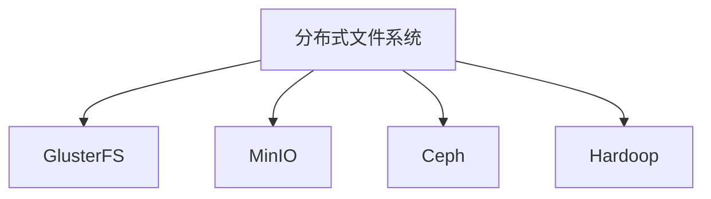
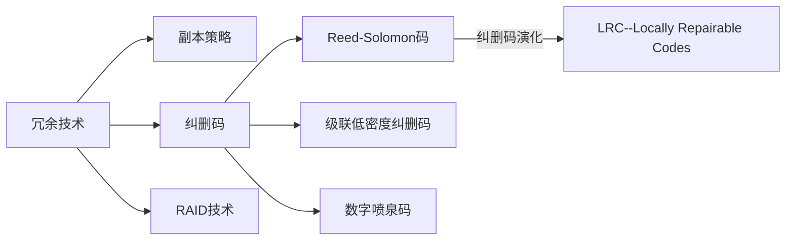

## 一、分布式文件系统

## 二、数据冗余技术

## 参考文档

1. [minio是怎么解决数据可靠性的?](https://ieevee.com/tech/2017/11/15/minio-erasure.html)

2. [Erasure Coding（纠删码）深入分析 转](https://www.bbsmax.com/A/MyJxxWXeJn/)

3. [RAID技术详解](https://www.cnblogs.com/efforeffor/p/6767161.html)