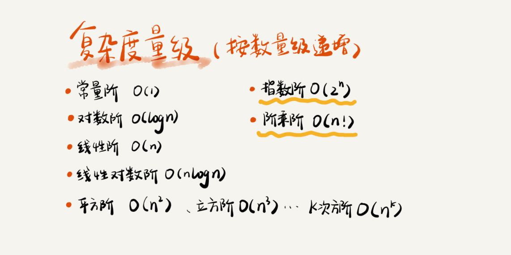

## 为什么要学习复杂度分析？
1. 事后统计法，测试结果非常依赖测试环境。
2. 测试结果受数据规模的影响很大。
3. 我们需要一个不用具体的测试数据来测试，就可以粗略的估计算法的执行效率的方法，大O复杂度表示法。

## 大O复杂度表示法
> T(n) = O (f(n)),如 T(n)= O(n),大O时间复杂度表示法，实际上并不具体表示代码真正的执行时间，而是表示代码执行时间随数据规模增长的变化趋势，所以，也叫作浙进时间复杂度（asymptotic time complexity），简称时间复杂度。在公式当中，低阶，常量，系数三部分并不左右增长趋势，可以忽略，只需要记录一个最大量级即可。

## 时间复杂度分析
1. 只关注循环次数最多的那段代码
2. 加法法则：总复杂度等于量级最大的那段代码的复杂度
   >可以分析每一部分的时间复杂度，然后把它们放到一块儿，再取一个量级最大的作为整段代码的复杂度。
3. 乘法法则：嵌套代码的复杂度等于嵌套内外代码复杂度的乘积

## 几种常见的时间复杂度实例分析

1. O(1)
2. O(logN), O(NlogN)
3. O(m+n),O(m*n)