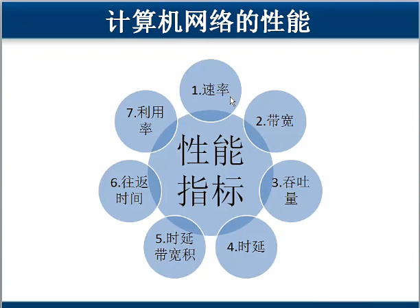

## 计算机网络性能指标

1. 速率：一个信道上的流量。
2. 带宽：网口所能支持的最大流量。
3. 吞吐量：所有信道上的流量和。
4. 时延：发送时延，传播时延，处理时延，排除时延
   > 光纤支持更高的发送速度，传播速度上来说，铜线比光纤还要快。但铜线不支持太高的发送速度。
5. 时延带宽积：在传输线路上的数据量
6. 往返时间：
   > 局域网内一般在1ms左右，太大了说明网络可能有问题。
7. 利用率
   * 信道利用率
   * 网络利用率