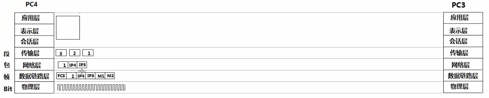

### 网络设备和OSI参考模型
1. 应用程序准备要传输的文件
2. 传输层（段） 将文件分段 并编号
3. 网络层 （包）添加目标IP地址
4. 数据链路层（桢） 两种情况 
   * 使用自己的子网掩码判断自己在哪个网段，使用自己的子网掩码，判断目标地址在哪个网段，* 如果是同一个网段，arp协议广播解析目标IP地址的MAC地址。
   * 如果不是同一个网段，
5. 物理层（Bit）
6. OSI数据层级图
