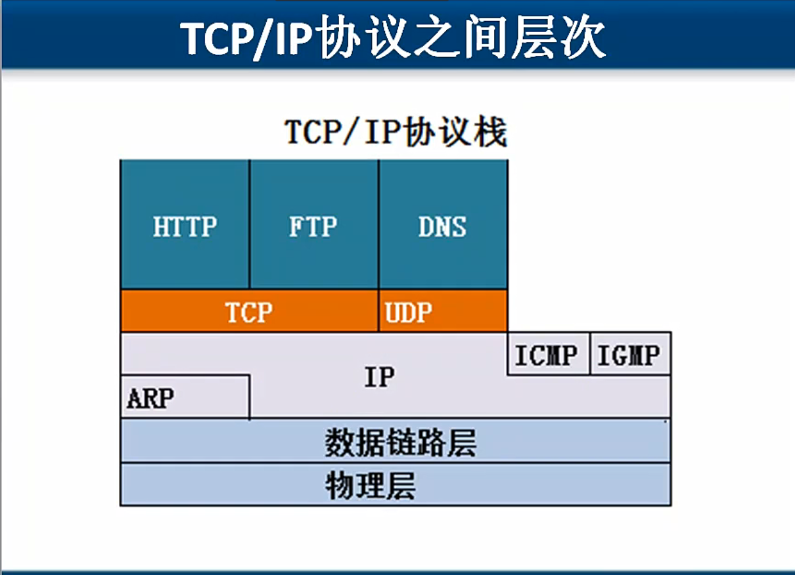

### 网络层协议
1. ARP
   * 将IP地址通过广播目标MAC地址是FF-FF-FF-FF-FF解析目标IP地址的MAC地址。
   * 这个只能在本网段的，不能跨路由器
   * arp -a 查看本地计算机缓存的MAC地址

### 网络执法官
1. arp进行欺骗
   解决办法：两台计算机机相互绑定静态MAC地址。一开机就执行静态MAC地址绑定。使用ARP防火墙。
   ```
   arp -s 192.168.1.10 MAC
   arp -a
   本地连接，修复，用于清除缓存。
   ```