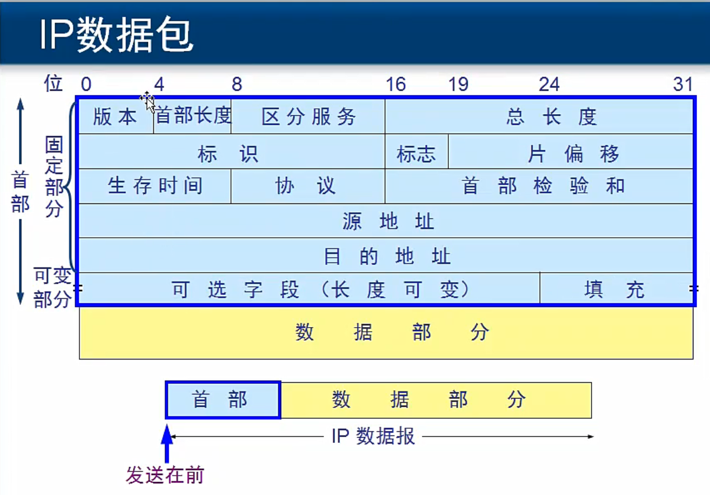

## IP数据包结构

version
区分服务 Windows 2008上 gepdit.msc

网络层 数据包最大 65535字节
数据链路层 数据最大1500字节 最大传输单元MTU
数据包  如果不分重叠，数据包数据最大不超过1480个字节

标识  识别分片时，是否同一个数据包中的分片
标志  是否完整的数据包
片偏移 偏移=第多少个字节/8
ping IP地址 -t - 65500 发送大包，用捕捉工具捕捉来查看分片信息
生存时间： 每经过1个路由TTL减1

协议号
ICMP 1
IGMP 2
TCP  6
UDP  17
IPv6 41

首部校验过程
数据部分不参与检验和的计算