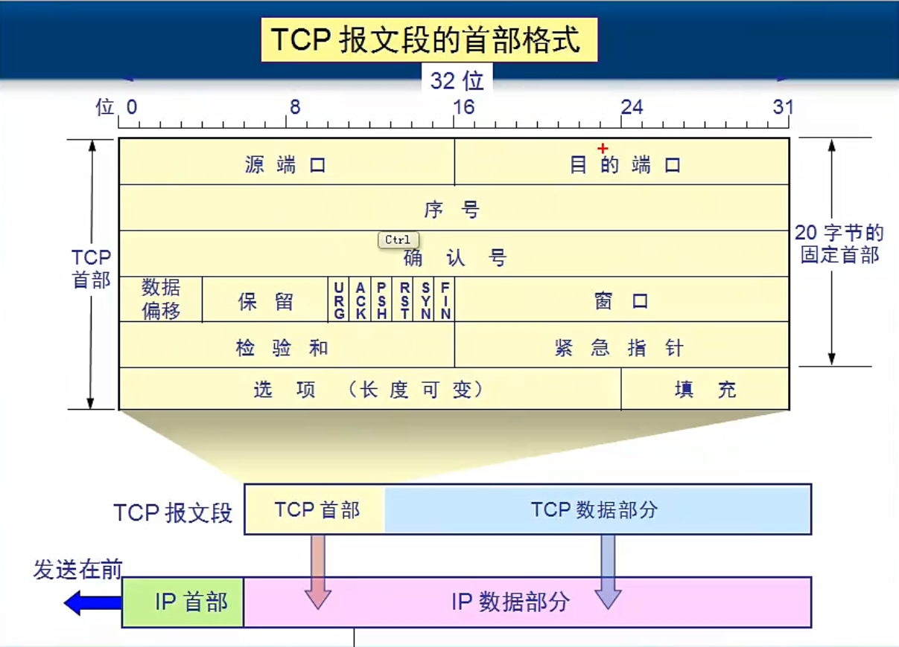
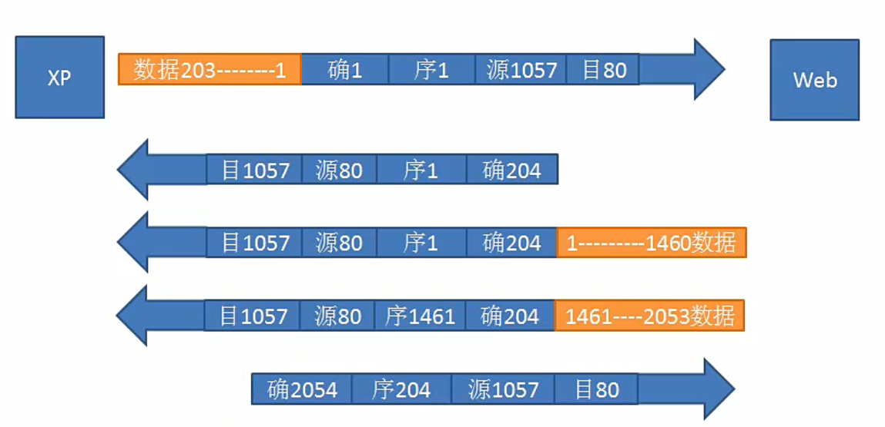

##  TCP首部

1. 知道序号是怎么来的？
2. 知道确认号是怎么来的？

### 标记位
1. URG：发送端插队有效
2. ACK
3. SYN
   > ACK和SYN建立会话使用
   > SYN攻击器：违造不存在的地址和服务器建立会话
   > Land攻击器： 违造地址为服务器自己的地址，使服务器资源快速耗净。
4. PSH: 接收端立即有效
5. RST: TCP出现严重的错误，需要释放连接
6. FIN: 数据传输完成标识，需要释放连接

### 窗口
> 告诉对方本服务器，缓存的大小

### 检验和
> 检验头部和数据

### 紧急指针
> 标记位URG有效时，根据这个紧急指针来指定要紧急发送的数据