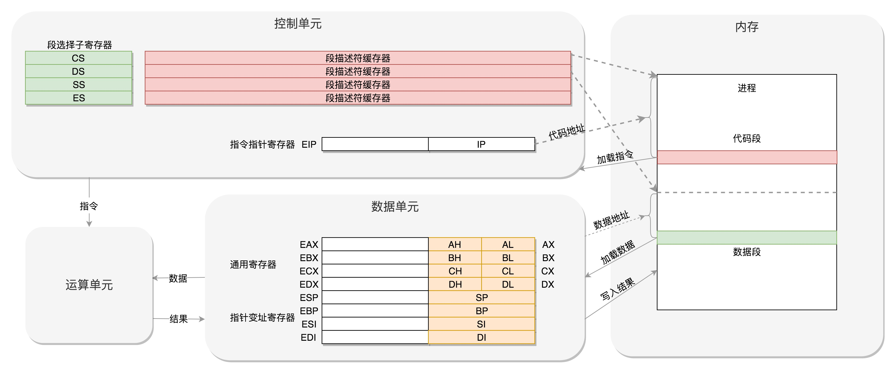

# 1 计算机的工作模式是什么样的？
## 1.1 概述

>`CPU`是计算机最核心的部分，通过**总线(Bus)**和其他设备连接，这些设备中，最重要的是 **内存（Memory）**

> 单靠 `CPU` 是没办法完成计算任务的，很多复杂的计算任务都需要将中间结果保存下来，然后基于中间结果进行进一步的计算。`CPU`本身没办法保存这么多中间结果，这就要依赖内存。

## 1.2 CPU 和 内存是如何配合工作的？
>`CPU`由 **运算单元**、**数据单元**、**控制单元** 组成
1. 运算单元只管算，如：加法、位移等。
2. 数据单元包括 CPU 内部的缓存和寄存器组，空间很小，速度飞快，要以暂时存放数据和运算结果。
  
   >运算单元计算的数据如果每次都要经过总结，到内存里面现拿，这样就太慢了。
3. 控制单元是一个统一的指挥中心，它可以获得一下条指令，然后执行这条指令。
  
   >有了放数据的地方，也有了算的地方，还需要有个指挥到底做什么运算的地方，这就是控制单元。

>每个进程都有一个程序放在硬盘上，是二进制的，再里面就是一行行一指令，会操作一些数据。

>进程一旦运行，会有独立的内存空间，互相隔离，程序会分别加载到进程各自的内存空间里面，形成各自的代码段。

4. CPU 怎么执行这些程序，操作这些数据，产生一些结果，并写入回内存呢？
   >CPU 的控制单元里面，有一个指令指针寄存器，它里面存放的是下一条指令在内存中的地址。控制单元会不停地将代码段的指令拿进来，先放入指令寄存器。

   >指令分两部分，一部分是做什么操作，另一部分是操作哪结数据。要执行这些指令，要把第一部分交给运算单元，第二部分交给数据单元。

5. 总线的概念
   >CPU和内存传数据，靠的都是总结，其实总线主要有两类数据，一个是地址数据，也就是我想拿内存中哪个位置的数据，这类总线叫**地址总线（Address Bus）**。另一类是真正的数据，这类总结叫**数据总线（Data Bus）**。

   >总线其实有点像连接 CPU 和 内存这两个设备的高速公路，说总线到底是多少位，就类似说高速公路有几个车道。

   >地址总线的位数，决定了能访问的地址范围到底有多广。而数据总线的位数，决定了一次能拿多少个数据进来。

# 2 8086处理器原理

## 2.1 数据单元
>8086 处理器内部有 8 个 16 位的通用寄存器，分别是 AX、BX、CX、DX、SP、BP、SI、DI。

>其中AX、BX、CX、DX 可以分成两个 8 位的寄存器来使用，分别是 AH、AL、BH、BL、CH、CL、DH、DL，其中 H 就是 High(高位)，L 就是 Low(低位)的意思。

## 2.2 控制单元
>IP 寄存器就是指令指针寄存器（Instruction Pointer Register），指向代码段中下一条指令的位置。CPU 会根据它来不断地将指令从内存的代码段中，加载到 CPU 的指令队列中，然后交给运算单元去执行。

>每个进程都分代码段和数据段，为了指向不同进程的地址空间，有四个 16 位的段寄存器，分别是 CS、DS、SS、ES。

>CS 就是代码段寄存器（Code Segment Register），通过它可以找到代码在内存中的位置； DS 是数据段的寄存器，通过它可以找到数据在内存中的位置。 SS 是栈寄存器（Stack Register），凡是与函数调用相关的操作，都与栈紧密相关。

>如果运算中需要加载内存中的数据，需要通过 DS 找到内存中的数据，加载到通用寄存器中，应该如何加载呢？对于一个段，有一个起始的地址，而段内的具体位置，我们称为**偏移量（offset）**。

>CS 和 DS 中都存放着一个段的起始地址。代码段的偏移量在 IP 寄存器中，数据段的偏移量会放在通用寄存器中。

>CS 和 DS 都是 16 位的，也就是说，起始地址都是 16 位的，IP 寄存器和通用寄存器都是 16 位的，偏移量也是 16 位的，但是 8086 的地址总线地址是 20 位。怎么凑够这 20 位呢？方法就是 **超始地址 \* 16 + 偏移量**，也就是把 CS 和 DS 中的值左移 4 位，变成 20 位的，加上 16 位的偏移量，这样就可以得到最终 20 位的数据地址。

>对于只有 20 位地址总线的 8086 来讲，能够区分出的地址就是 2^20 = 1M，因为偏移量只能是 16 位的，所以一个段最大的大小是 2^16 = 64K。

# 3 再来说 32 位处理器
>在 32 位处理器中，有 32 根地址总线，可以访问 2^32 = 4G 的内存。“开放”，意味着有大量其他公司的软硬件是基于这个架构来实现的，需要遵循`开放、统一、兼容`的位置。

## 3.1 在开放架构的基础上，如何保持兼容呢？
>首先，通用寄存器有扩展，可以将 8 个 16 位的扩展到 8 个 32 位的，但是依然可以保留 16 位的和 8 位的使用方式。

>其中，指向下一条指令的指令指针寄存器 IP，就会扩展成 32 位的，同样也兼容 16 位的。而改动比较大的，有点不兼容的就是**段寄存器（Segment Register）**。

>因为原来的模式其实有点不伦不类，因为它没有把 16 位当成一个段的起始地址，也没有按 8 位 或者 16 位扩展的形式，而是根据当时的硬件，弄了一个不上不下的 20 位的地址。这样每次都要左移四位，也就意味着段的起始地址不能是任何一个地方，只是能整除 16 的地方。

>32位寄存器中，CS、DS、SS、ES 仍然是 16 位的，但是不再是段的起始地址。段的起始地址放在内存的某个地方。这个地方是一个表格，表格中的一项一项是**段描述符（Segment Descriptor）**。这里面才是真正的段的起始地址。而段寄存器里面保存的是在这个表格中的哪一项，称为**选择子（Selector）**。

>这样，将一个从段寄器直接拿到的段起始地址，就变成了先间接地从段寄存器找到表格中的一项，再从表格中的一项中拿到段起始地址。

>这样段起始地址就会很灵活了，当然为了快速拿到段起始地址，段寄存器会从内存中拿到 CPU 的描述符高速缓存器中。

>这样就不太兼容，好在采用选择子的这种模式灵活度非常高，可以保持将来一直兼容下去。在 32 位的系统架构下，将 16 位架构系统架构时的段寄存器直接存地址的这种模式，称为 `实模式（Real Pattern）`，采用选择子的这一种模式称为`保护模式（Protected Pattern）`。

>当系统刚刚启动的时候，CPU 是牌实模式的，这个时候和原来的模式是兼容的。当需要更多内存的时候，可以遵循一定的规则，进行一系列的操作，然后切换到保护模式，就能够用到 32 位 CPU 更强大的能力。

