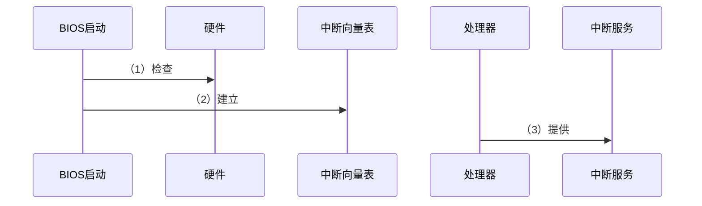
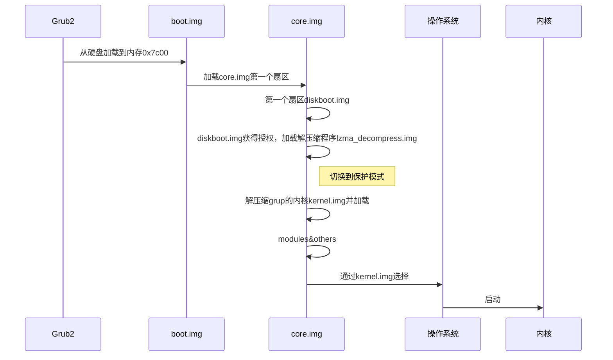
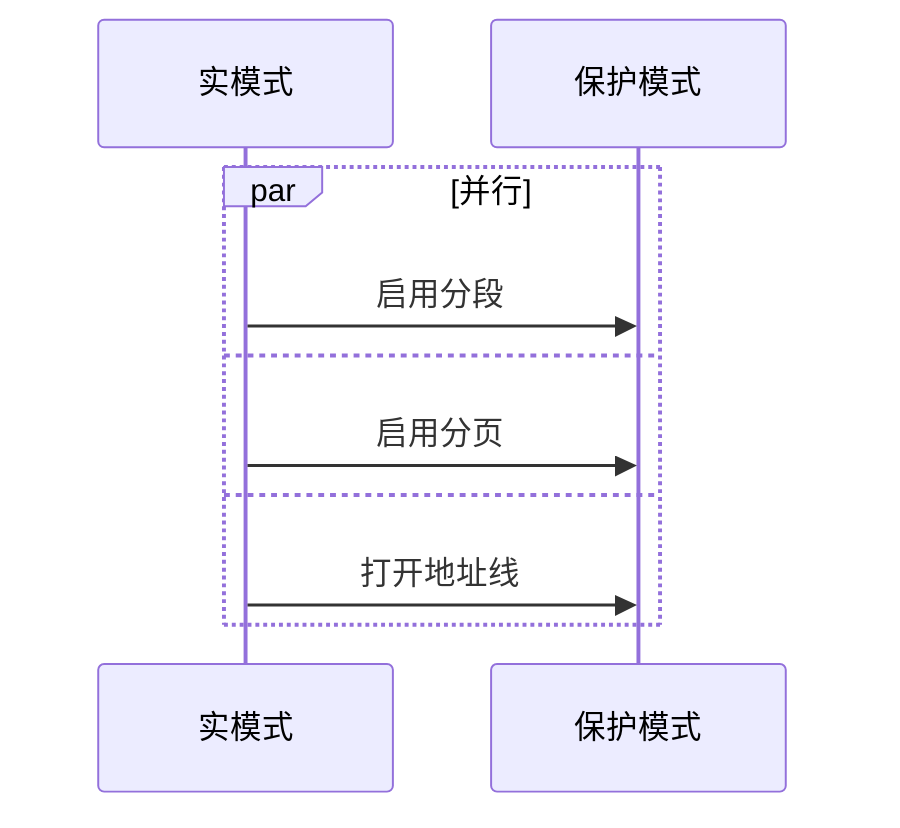

## 1 BIOS时期（创业初期）

> 主板加电，此时还没有操作系统，内存一片空白，在主板上，有一个东西叫`ROM(Read Only Memory)`只读存储器，上面提前固化了一些初始化的程序，即`BIOS(Basic Input and Output System,基本输入输出系统)`。

### 1.1 ROM固化程序（创业指导手册）

> 在 x86 系统中，将 1M 空间最上面的 `0xF0000` 到 `0xFFFFF`这 64K 映射给 ROM,也就是说，到这部分地址访问的时候，会访问 ROM 。
>
> 在电脑刚加电的时候，会做一些重置的工作，将 CS 设置为 `0xFFFF`，将 IP 设置为 `0x0000`，所以第一条指令就会指向 `0xFFFF0`，正是在 ROM 的范围内。

## 2 bootloader 时期（查找企业经营宝典）

### 2.1 打听操作系统

> BIOS 界面上，有一个启动盘选项，启动盘一般在`第一个扇区`，占 `512`字节，以`0xAA55`结束，这个扇区通常称为 `MBR(Master Boot Record，主引导记录/扇区)`。启动盘里面主要放的是启动系统的代码，如`Grub2,全称Grand Unified Bootloader Version 2`。启动过程如下：

| 模块                         | 对应代码                                        |
| ---------------------------- | ----------------------------------------------- |
| boot.img                     | boot.S编译而成                                  |
| core.img->diskboot.img       | diskboot.S                                      |
| core.img->lzma_decompress.mg | startup_raw.S                                   |
| core.img->kernel.img         | startup.S 会调用 grup kernel 的主函数 grub_main |

> 在这之前，我们所有遇到过的程序都非常非常小，完全可以在实模式下运行，但是随着我们加载的东西越来越大，实模式这 `1M`的地址空间实在放不 下了，所以在真正的解压之前，`lzma_decompress.img`做了一个重要决定，就是调用`real_to_prot`，切换到保护模式，这样能在更大的寻址空间里面，加载更多的东西。

## 3 从实模式切换到保护模式

### 3.1 启用分段

> 就是在内存里面建立段描述符表，将寄存器里面的段寄存器变成段选择子，指向某个段描述符，这样就能实现不同进程的切换。

### 3.2 启动分页

> 内存变大，将内存分成相等大小的块，进行内存管理。

### 3.3 打开地址线

> 保护模式需要做一项工作，打开`Gate A20`，即第`21`根地址线的控制线，在实模式 8086 下面，一共就 20 个地址线，可访问 `1M` 的地址空间。在保护模式下，第 `21` 根要起作用，于是我们就需要打开 `Gate A20`。

### 3.4 加载内核

