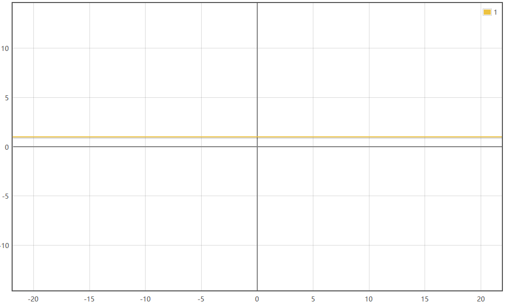
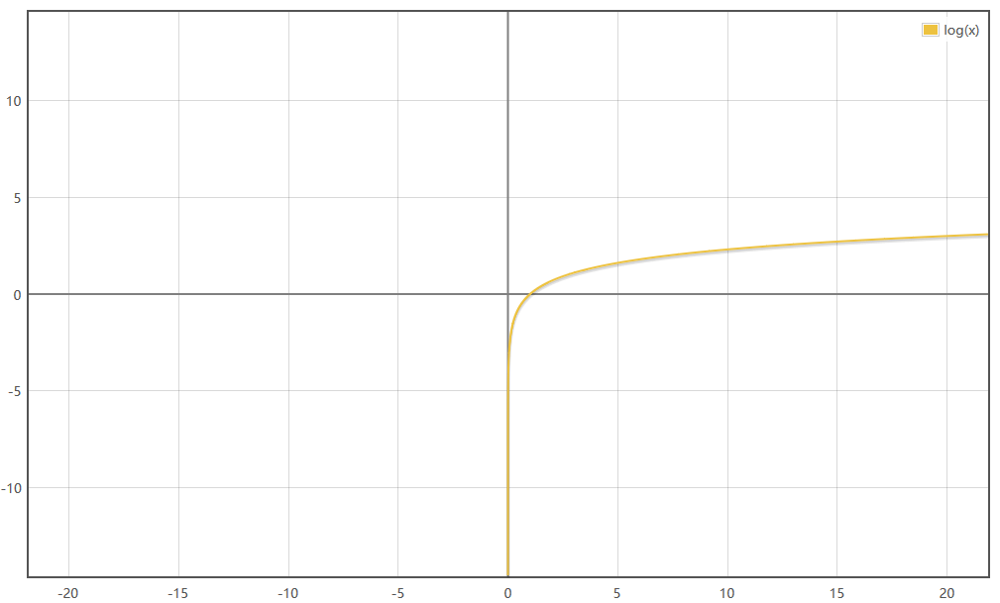
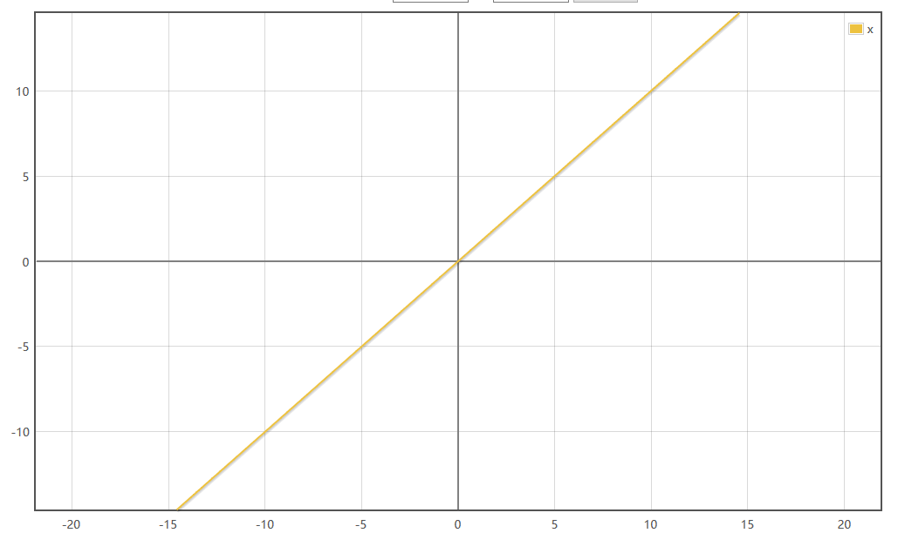
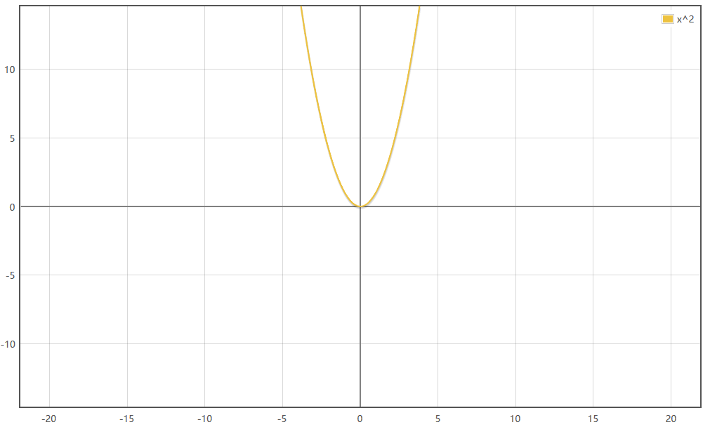
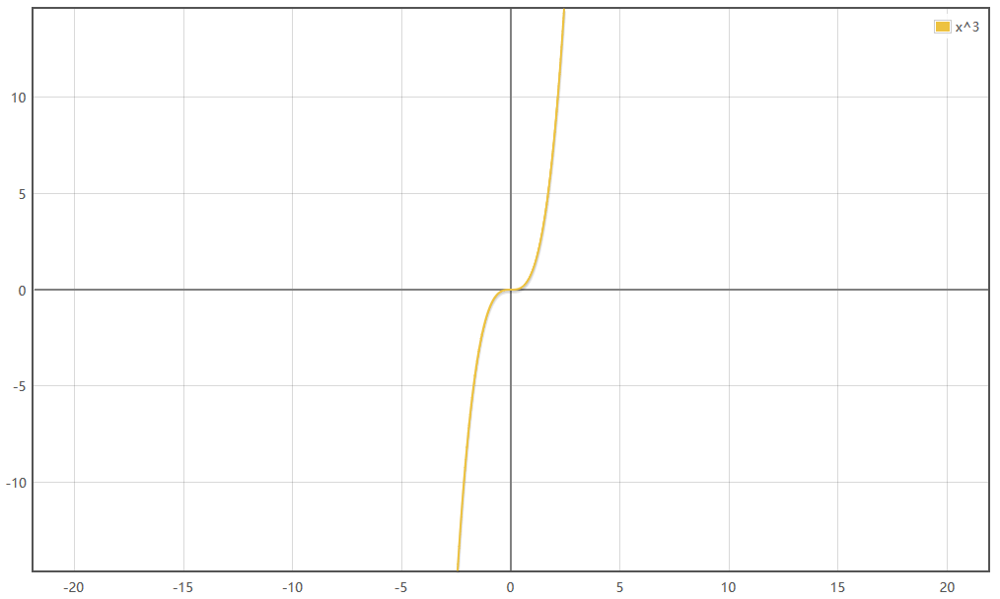
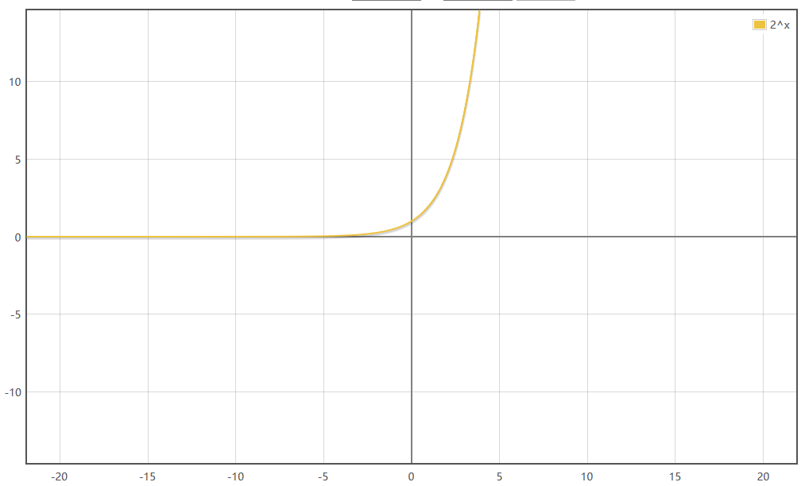
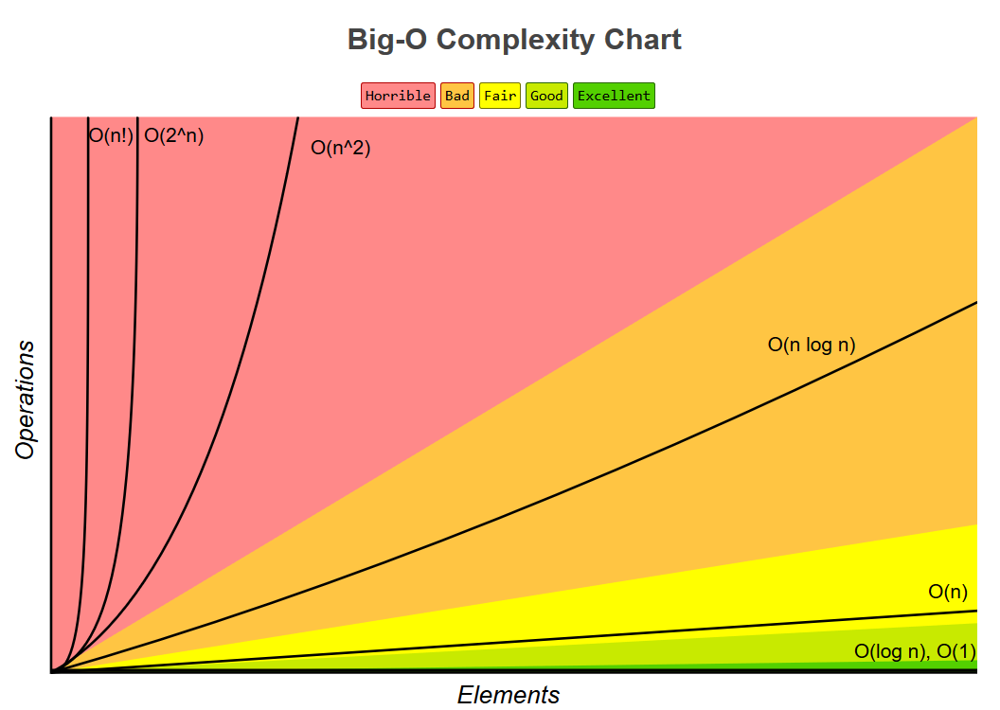

## 时间复杂度的比较

| 时间复杂度 | 解释|
|:--|:--:|
| O(1)| 大部分程序的大部分指令只执行一次，或者最多几次。如果一个程序的所有指令都具有这样的性质，我们说这个程序的执行时间是常数。|
| OlogN|如果一个程序的运行时间是对数级的，则随着N的增大程序会渐渐慢下来，如果一个程序将一个大的问题分解成一系列更小的问题，每一步都将问题的规模分解成一系列更小的问题，每一步都将问题的规模缩减成几分之一，一般就会出现这样的运行时间函数。在我们所关心的范围内，可以认为运行于一个大的常数。对数的基数会影响这个常数，但改变不会太大：当N=1000时，如果基数是10，logN等于3；如果基数是2，logN约等于10.当N=1 00 000，logN只是前值的两倍。当N是原来的两倍，logN只增长了一个常数因子：仅当从N增长到N平方时，logN才会增长到原来的两倍。|
| O(N)       | 如果程序的运行时间是线性的，很可能是这样的情况：对每个输入的元素都做了少量的处理。当N=1 000 000时，运行时间大概也就是这个数值，当N增长到两倍时，运行时间大概也增长到原来的两倍。如果一个算法必须处理N个输入（或者产生N个输出），那么这种情况是最优的。|
| O(NlogN)   | 如果某个算法将问题分解成更小的了问题，独立地解决各个子问题，最后将结果综合起来，运行时间一般就是NlogN。我们找不到一个更好的形容，就暂且将这样的算法运行时间叫做NlogN。当N=1 000 000时，NlogN大约是20 000 000。当N增长到原来的两倍，运行时间超过原来的两倍，但超过不是太多。|                                                                                                                                                                                                                                                
| O(N$^2$)   | 如果一个算法的运行时间是二次方，那么它一般只能用于一些规模较小的问题。这样的运行时间通常存在于需要处理每一对输入数据项的算法（在程序中很可能表现为一个嵌套循环）中，当N=1000时，运行时间是1 000 000；如果N增长到两倍，则运行时间将增长到原来的四倍。|                                                                                                                                                                                                                                                                     
| O(N$^3$)   | 类似的，如果一个算法需要处理输入数据项的三元组（很可能表现为三重嵌套循环），其运行时间一般就是三次的，只能用于一些规模较小的问题。当N=100时，运行时间就是1 000 000；如果N增长到原来的两倍，运行时间将会增长到原来的八倍。|                                                                                                                                                                                                                                                                                            
| O(2 $^N$)   | 如果一个算法的运行时间是指数级的，一般它很难在实践中使用，即使这样的算法通常是对问题的直接求解。当N=20时，运行时间是 1 000 000；如果增长到原来的两倍时，运行时间将是原时间的平方！|                                                                                                                                                                                                                                                                                                                                       
| O(loglogN) | 可以看作是一个常数，即使N很多，两次去对数之后也会变得很小|                                                                                                                                                                                                                                                                                                                                                                                                                                                        

本方引自：http://clarkluo2004.blog.163.com/blog/static/32973801200845115213422/  

