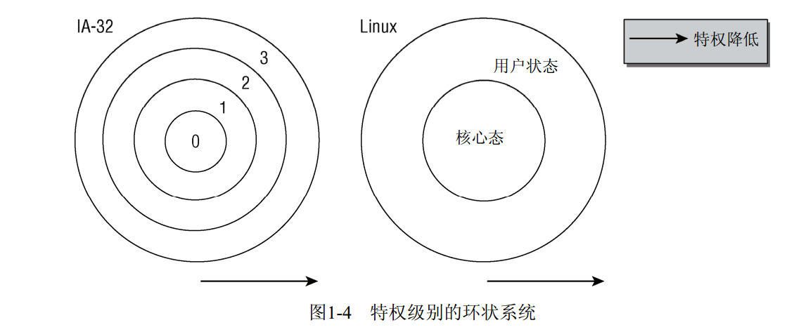
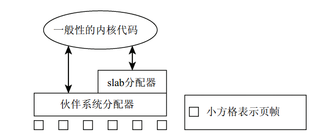

# 第一章 简介和概述
## 1.1 内核的任务
   * 程序的角度——增加的计算机
   * 并发运行时——资源管理程序
   * 内核的角度——库

## 1.2 实现策略
   * 微内核——模块划分清晰，模块切换消耗CPU时间，实际应用进展较慢。
   * 宏内核——功能间相互调用，可能会嵌套，Linux使用的是这种策略，还使用了模块的热插拔功能，来弥补一些缺陷。

## 1.3 内核组成部分
### 1.3.1 进程、进程切换、调度
   * 进程——传统上，在UNIX上运行的应用程序、服务器、及其他程序等。
   * 进程切换——通过在撤销进程的CPU资源之前保存进程所有与状态相关的要素，并将进程置于空闲状态，在重新激活进程时，则将保存的状态原样恢复。
   * 调度——确定哪个进程在CPU上运行多长时间的过程。

### 1.3.2 UNIX进程
   > linux对进程采用了一种层次系统，每个进程都依赖于一个父进程。内核启动init程序作为第一个进程，该进程负责进一步的系统初始化操作。可通过pstree命令查看进程树。UNIX操作系统中有两种创建新进程的机制，分别是fork和exec。
   * fork：可以创建当前进程的一个副本，父进程和子进程只有PID(进程ID)不同。通过写时复制（copy on write）技术，使得fork操作更有效。
   * exec： 将一个程序加载到当前进程的内存中并执行。
   > 除了重量级进程（有时也称为UNIX进程）之外，还有一种形式是线程（有时也称为轻量级进程）。本质上一个进程可能由若干线程组成，这些线程共享同样的数据和资源，但可能执行程序中不同的代码路径。由于线程和进程共享同样的地址空间，主程序自动就可以访问接收到的数据，因此除了为防止线程访问同一内存而采取的互斥机制外，就不需要什么通信了。Linux用clone方法创建线程。其工作方式类似于fork,但启用了精确的检查。

### 1.3.3 地址空间与特权级别
   * 使用缩写KiB、MiB、GiB作为容量单位，分别表示$2^{10}$、 $2^{20}$、 $2^{30}$字节。  
   * CPU的字长决定了所能管理的地址空间的最大长度。对32位系统,是$2^{32}B=4GiB$，对64位处理器,可以管理$2^{64}B=16TiB$。  
   * 地址空间的最大长度与实际可用的物理内存数量无关,因此被称为`虚拟地址空间`。
   * Linux将虚拟地址空间划分为两个部分，分别称为`内核空间`和`用户空间`
   * 系统中每个用户进程都有自身的虚拟地址范围,从0到TASK_SIZE。用户空间之上的区域（从TASK_SIZE到$2^{32}$或$2^{64}$）保留给内核使用,用户进程不能访问.TASK_SIZE是一个特定于计算机体系结构的常数,把地址空间按给定比例划分为两个部分。如：在IAT-32系统中，地址空间是在3GiB处划分,因此每个进程的虚拟地址空间为3GiB。由于虚拟地址空间的总长度是4GiB,所以内核空间有1GiB可用。
   * 这种划分与可用的内存数量无关，由于地址空间虚拟化的结果,每个用户进程都认为自身有3GiB内存，各个系统进程的用户空间是完全彼此分离的。而虚拟地址空间顶部的内容空间总是同样的,无论当前执行的是哪个进程。

   1. 特权级别
   * 所有的现代CPU都提供了几种特权级别，进程可以驻留在某一特权级别。每个级别都有各种限制。
   * IA-32体系结构使用4种特权级别构成的系统，各级别可以看作是环，内环能够访问更多的功能，外环则较少，如，但linux只使用g两种不同的状态:`核心态`和`用户态`,两种状态的关键差别在于对高于TASK_SIZE的内存区域的访问。
   * 从用户状态到核心态的切换通过系统调用的特定转换手段来完成,且系统调用的执行因具体系统而不同。
   * 普通进程→（想要操作输入/输出装置）→向内核发出请求→内核检查进程是否允许执行想要的操作→代表进程执行所需操作→返回到用户态。
   * 除了代表用户程序执行代码之外,内核可以由异步硬件中断激活,然后在```中断上下文```中运行。
   * 在核心态和用户态执行。CPU大多数时间都在执行用户空间中的代码。当应用程序执行系统调用时,则切换到核心态,内核将完成其请求.在此期间,内核可以访问虚拟地址空间的用户部分。在系统调用完成之后,CPU换回用户状态。硬件中断也会使CPU切换到核心态,这种情况下内核不能访问用户空间。
   2. 虚拟和物理地址空间
   * 内核和CPU使用页表将实际可用的物理内存映射到虚拟地址空间的区域，虚拟地址关系到进程的用户空间和内核空间,而物理地址则用来寻址实际可用的内存。
   * 内核将虚拟地址空间划分为很多等长的部分,这些部分称之为页。
   * 物理内存也划分为同样大小的页，这些页被称为页帧，相比之下，页则专指虚拟地址空间中的页。
   * 不同进程的同一虚拟地址实际上具有不同的含义。

### 1.3.4 页表
   * 用来将虚拟地址空间映射到物理地址空间的数据结构称为页表。
   * 实现两个地址之间的关联最容易的方法是使用数组，对虚拟地址空间中的每一页，都分配一个数组项。该数组项指向与之关联的页帧，但单个数组的话占内存会非常大，有点不切实际，在这里可以使用功能相同，但内存用量少得多的模型`多级分页`，因为虚拟地址空间中的大部分区域都没有使用，也没有关联的页帧。
   * 当然多级分页有一个缺点，每次访问内存时，必须逐级访问多个数组才能将虚拟地址转换为物理地址。CPU试图用下面两种方法加速该过程
      * CPU中有一个专门的部分称为MMU(Memory Management Unit，内存管理单元)，该单元优化内存访问操作。
      * 地址转换中出现最频繁的地址，保存到称为地址转换后备缓冲器（Translation Lookaside Buffer,TLB）的CPU高速缓存中。无需访问内存中的页表即可从高速缓存直接获得地址数据，因页大大加速了地址转换。

### 1.3.5 物理内存的分配
   * 内核分配内存时，必须记录页帧的已分配或空闲状态，以免两个进程使用同样的内存区域。
   * 内存分配和释放非常频繁，内核还必须保证相关操作尽快完成。
   * 内核可以只分配完整的页帧，用户空间中的标准库将来源于内核的页帧拆分为小的区域，并为进程分配内存。
   1. 伙伴系统
      * 伙伴系统这种技术能够快速检测内存中的连续区域。方便内核分配连续页。
      * 系统中缺乏连续页帧组成的较大的内存块，而从性能上考虑，却又需要使用较大的内存块。通过伙伴系统在某种程序上能够减少这种效应，但不能完全避免。
   1. Slab缓存
      * 内核本身经常需要比完帧页块小得多的内存块。由于内核无法使用标准库的函数，因而必须在伙伴系统基础上自行定义额外的内存管理层，将伙伴系统提供的页划分成更小的部分。该方法不公可以分配内存，还为频繁使用的小对象实现了一个一般性的缓存——Slab缓存。它可以使用两种方法分配内存
      * 对频繁使用的对象，内核定义了只包含了所需类型对象实例的缓存。每次需要某种对象时，可以从对应的缓存快速分配（使用后释放到缓存）。Slab缓存自动维护与伙伴系统的交互，在缓存用尽时会请求新的页帧。
      * 对通常情况下小内存块的分配，内核针对不同大小的对象定义了一组Slab缓存，可以像用户空间编程一样，用相同的函数访问这些缓存。不同之处是这些函数都增加了前缀K，表明是与内核相关联的。
      * Slab分配器在各种负荷下的性能都很好，但在真正宏大的超级计算机上时，出现一些可伸缩性问题。另一方面对真正微小的嵌入式系统来说，slab的开销可能又太大了。
      * 总结：页帧的分配由伙伴系统进行，百slab分配器则负责分配小内存以及提供一般性内核缓存，如所示
   1. 页面交换和页面回收
      * 页面交换通过利用磁盘空间作为扩展内存,从而增加了可用的内存。在内核需要更多内存时,不经常用的页可以写入硬盘。如果再需要访问相关数据，内核会将相应的页切换回内存。通过缺页异常机制，这种切换操作对应用程序是透明的。
      * 页面回收用于将内存映射被修改的内容与底层的块设备同步,为此有时也称为数据回写。数据刷出后,内核即可将页帧用于其他用途(类似于页面交换)，内核的数据结构包含了与此相关的所有信息,当再次需要该数据时,可根据相关信息从硬盘找到相应的数据并加载。
### 1.3.6 计时
   * 内核必须能够测量时间以及不同时间点的差，进程调度就会用到该功能。jiffies是一个合适的时间坐标。名为jiffies_64和jiffies(分别是64位和32位)的全局变量，会按恒定的时间间隔递增。
   * jiffies递增的频率与体系结构有关，取决于内核中一个主要的常数HZ。
   * 计时的周期是可以动态改变的。
### 1.3.7 系统调用
   * 系统调用是用户进程与内核交互的经典方法。传统的系统调用按不同类别分组，如下所示：
      * 进程管理：创建新进程，查询信息，调试。
      * 信号：发送信号，定时器以及相关处理机制。
      * 文件：创建，打开和关闭文件，从文件读取或向文件写入，查询信息和状态。
      * 目录和文件系统：创建，删除和重命名目录，查询信息，链接，变更目录。
      * 保护机制：读取和变更UID/GID,命名空间的处理。
      * 定时器函数：定时器函数和统计信息。
   * 对所有的处理器来说，一个共同点就是：用户进程要从用户状态切换到核心态，并将系统关键任务委派给内核执行，系统调用是必由之路。
### 1.3.8 设备驱动程序、块设备和字符设备
   * 设备驱动程序用于与系统连接的输入/输出装置通信，它的任务在于支持应用程序经由设备文件与设备通信。
   * 外设可以分为以下两类
      * 字符设备：提供连接的数据流，应用程序可以顺序读取，通常不支持随机存取。如：调制解调器。
      * 块设备：应用程序可以随机访问设备数据，程序可自行确定读取数据的位置。如：硬盘。此外，数据的读写只能以块（通常是512B）的倍数进行，与字符设备不同，块设备并不支持基于字符的寻址。
### 1.3.9 网络
   * 网卡也可以通过设备驱动程序控制，但在内核中属于状况，因为网卡不能利用设备文件访问。
### 1.3.10
   * 
   


